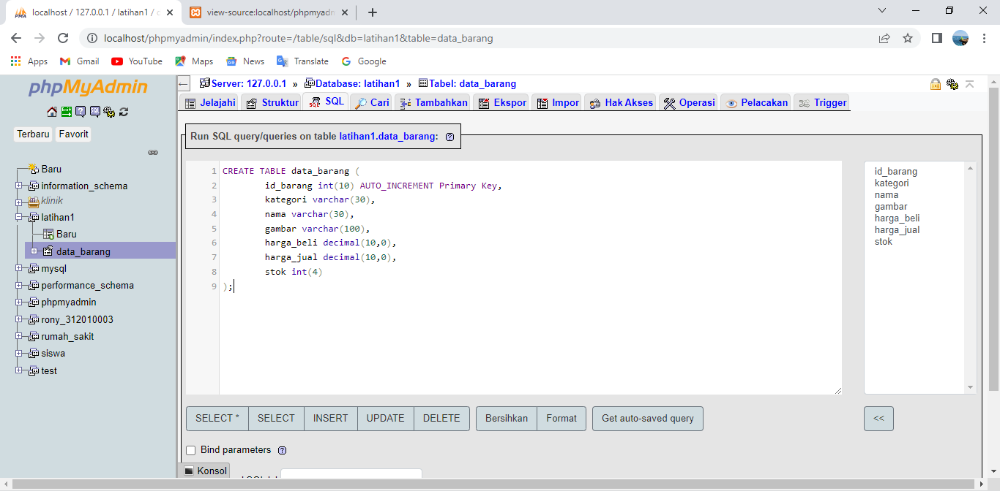
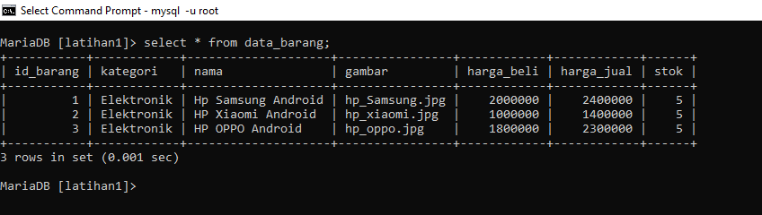
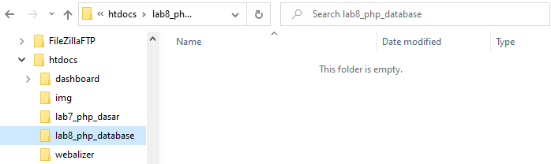
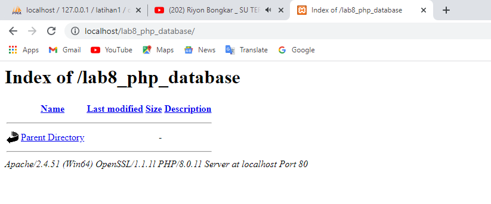
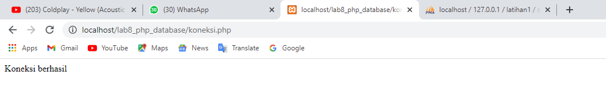
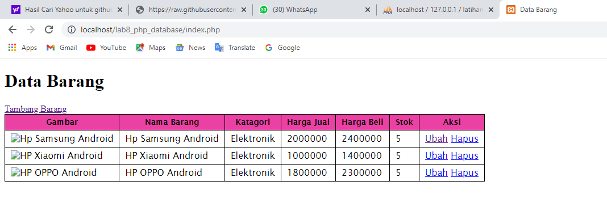
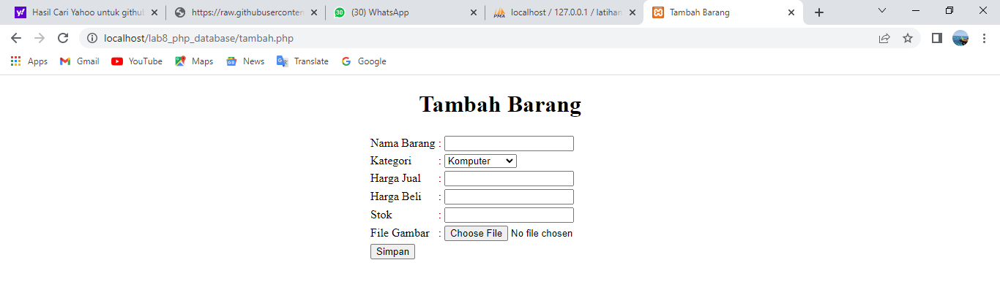
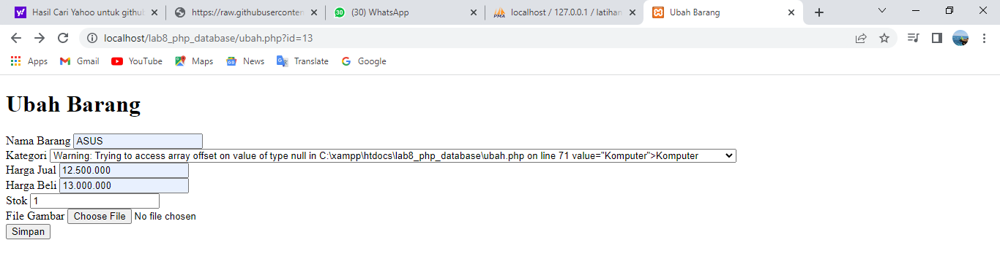

| RONY ELTOM ATIBAMAN |    312010063    |
|---------------------|-----------------|
|   TI.20 D.1         | Pemograman Web  |

# Lab8web
## Menjalankan MySQL Server
Untuk menjalankan MySQL Server dari menu XAMPP Contol.<br>
<br>

## Mengakses MySQL Client menggunakan PHP MyAdmin
Pastikan webserver Apache dan MySQL server sudah dijalankan. Kemudian buka melalui browser: http://localhost/phpmyadmin/ <br>

## Membuat Database
```CREATE DATABASE latihan1;```

## Membuat Tabel
```CREATE TABLE data_barang (
id_barang int(10) auto_increment Primary Key,
kategori varchar(30),
nama varchar(30),
gambar varchar(100),
harga_beli decimal(10,0),
harga_jual decimal(10,0),
stok int(4)
);
```


## Menambahkan Data
```
INSERT INTO data_barang (kategori, nama, gambar, harga_beli, harga_jual, stok)
VALUES ('Elektronik', 'HP Samsung Android', 'hp_samsung.jpg', 2000000, 2400000, 5),
('Elektronik', 'HP Xiaomi Android', 'hp_xiaomi.jpg', 1000000, 1400000, 5),
('Elektronik', 'HP OPPO Android', 'hp_oppo.jpg', 1800000, 2300000, 5);
```


## Membuat Program CRUD
Buat folder lab8_php_database pada root directory web server (d:\xampp\htdocs).<br>


Kemudian untuk mengakses direktory tersebut pada web server dengan mengakses URL: http://localhost/lab8_php_database/ <br>


## Membuat file koneksi database
Buat file baru dengan nama koneksi.php<br>
```
<?php
$host = "localhost";
$user = "root";
$pass = "";
$db = "latihan1";
$conn = mysqli_connect($host, $user, $pass, $db);
if ($conn == false)
{
echo "Koneksi ke server gagal.";
die();
} #else echo "Koneksi berhasil";
?>
```
Buka melalui browser untuk menguji koneksi database (untuk menyampilkan pesan
koneksi berhasil, <b>uncomment</b> pada perintah echo <i>“koneksi berhasil”</i>;<br>
<br>

## Membuat file index untuk menampilkan data (Read)
Buat file baru dengan nama <b>index.php</b><br>
```
<?php
include("koneksi.php");
// query untuk menampilkan data
$sql = 'SELECT * FROM data_barang';
$result = mysqli_query($conn, $sql);
?>
<!DOCTYPE html>
<html lang="en">
<head>
    <meta charset="UTF-8">
    <link href="style.css" rel="stylesheet" type="text/css" />
    <title>Data Barang</title>
</head>
<body>
    <div class="container">
        <h1>Data Barang</h1>
        <div class="main">
            <a href="tambah.php">Tambang Barang</a>
            <table>
            <tr>
                <th>Gambar</th>
                <th>Nama Barang</th>
                <th>Katagori</th>
                <th>Harga Jual</th>
                <th>Harga Beli</th>
                <th>Stok</th>
                <th>Aksi</th>
            </tr>
            <?php if($result): ?>
            <?php while($row = mysqli_fetch_array($result)): ?>
            <tr>
                <td>" alt="<?=
$row['nama'];?>"></td>
                <td><?= $row['nama'];?></td>
                <td><?= $row['kategori'];?></td>
                <td><?= $row['harga_beli'];?></td>
                <td><?= $row['harga_jual'];?></td>
                <td><?= $row['stok'];?></td>
                <td>
                <a href="ubah.php?id=<?= $row['id_barang'];?>">Ubah</a>
                <a href="hapus.php?id=<?= $row['id_barang'];?>">Hapus</a> 
                </td>
            </tr>
            <?php endwhile; else: ?>
            <tr>
                <td colspan="7">Belum ada data</td>
            </tr>
            <?php endif; ?>
            </table>
        </div>
    </div>
</body>
</html>
```
```
table{
    border-collapse:collapse;
    font-family:'Lucida Sans', sans-serif;
    color:#000000
}
table th{
    background:#eb41a4;
    color:#0a0000;
    font-weight:bold;
    font-size:14px;
}
table th, td{
    vertical-align:top;
    padding:5px 10px;
    border:1px solid #000000;
}
table tr{
    background:#FFF;
}
table tr:nth-child(even){
    background:#FFF;
}
```


## Menambah Data (Create)
Buat file baru dengan nama <b>tambah.php</b>.
```
<?php
error_reporting(E_ALL);
include_once 'koneksi.php';

if (isset($_POST['submit']))
{
    $nama = $_POST['nama'];
    $kategori = $_POST['kategori'];
    $harga_jual = $_POST['harga_jual'];
    $harga_beli = $_POST['harga_beli'];
    $stok = $_POST['stok'];
    $file_gambar = $_FILES['file_gambar'];
    $gambar = null;
    if ($file_gambar['error'] == 0)
    {
        $filename = str_replace(' ', '_',$file_gambar['name']);
        $destination = dirname(_FILE_) .'/gambar/' . $filename;
        if(move_uploaded_file($file_gambar['tmp_name'], $destination))
        {
            $gambar = 'gambar/' . $filename;;
        }
    }
    $sql = 'INSERT INTO data_barang (nama, kategori,harga_jual, harga_beli, stok, gambar) ';
    $sql .= "VALUE ('{$nama}', '{$kategori}','{$harga_jual}', '{$harga_beli}', '{$stok}', '{$gambar}')";
    $result = mysqli_query($conn, $sql);
    header('location: index.php');
}
?>
<!DOCTYPE html>
<html lang="en">
<head>
    <meta charset="UTF-8">
    <meta http-equiv="X-UA-Compatible" content="IE=edge">
    <meta name="viewport" content="width=device-width, initial-scale=1.0">
    <link href="tambahstyle.css" rel="stylesheet" type="text/css" />
    <title>Tambah Barang</title>

    <style>
        body {
            background-color: #FFF;
        }
    </style>
</head>
<body>
    <div class="container">
        <h1><center>Tambah Barang</h1></center>
    <div class="main">
        <form method="post" action="tambah.php" enctype="multipart/form-data">
            <table border="0" align="center">
                <tr>
                    <div class="input">
                        <td>Nama Barang</td>
                        <td>:</td>
                        <td><input type="text" name="nama" /></td>
                    </div>
                </tr>
                <div class="input">
                    <td>Kategori</td>
                    <td>:</td>
                    <td><select name="kategori">
                        <option value="Komputer">Komputer</option>
                        <option value="Elektronik">Elektronik</option>
                        <option value="Hand Phone">Hand Phone</option>
                        </select>
                    </td>
                </div>
                </tr>
                <div class="input">
                    <td>Harga Jual</td>
                    <td>:</td>
                    <td><input type="text" name="harga_jual" /></td>
                </div>    
                </tr>
                <div class="input">
                    <td>Harga Beli</td>
                    <td>:</td>
                    <td><input type="text" name="harga_beli" /></td>
                </div>  
                </tr>
                <div class="input">
                    <td>Stok</td>
                    <td>:</td>
                    <td><input type="text" name="stok" /></td>
                </div>
                </tr>
                <div class="input">
                    <td>File Gambar</td>
                    <td>:</td>
                    <td><input type="file" name="file_gambar" /></td>
                </div>
                </tr>
                <div class="submit">
                    <td><input type="submit" name="submit" value="Simpan" /></td>
                </div>
                </tr>
            </table>
        </form>
    </div>
    </div>
</body>
</html>
```
<br>

## Mengubah Data (Update)
Buat file baru dengan nama <b>ubah.php</b>.
```
<?php
error_reporting(E_ALL);
include_once 'koneksi.php';

if (isset($_POST['submit']))
{
    $id = $_POST['id'];
    $nama = $_POST['nama'];
    $kategori = $_POST['kategori'];
    $harga_jual = $_POST['harga_jual'];
    $harga_beli = $_POST['harga_beli'];
    $stok = $_POST['stok'];
    $file_gambar = $_FILES['file_gambar'];
    $gambar = null;

    if ($file_gambar['error'] == 0)
    {
        $filename = str_replace(' ', '_', $file_gambar['name']);
        $destination = dirname(__FILE__) . '/gambar/' . $filename;
        if (move_uploaded_file($file_gambar['tmp_name'], $destination)) 
        {
            $gambar = 'gambar/' . $filename;;
        }
    }
    
    $sql = 'UPDATE data_barang SET ';
    $sql .= "nama = '{$nama}', kategori = '{$kategori}', ";
    $sql .= "harga_jual = '{$harga_jual}', harga_beli = '{$harga_beli}', stok
= '{$stok}' ";
    if (!empty($gambar))
        $sql .= ", gambar = '{$gambar}' ";
    $sql .= "WHERE id_barang = '{$id}'";
    $result = mysqli_query($conn, $sql);

    header('location: index.php');
}
//$id = $_GET['id'];
$id = (isset($_POST['id']) ? $_POST['id'] : '');
$sql = "SELECT * FROM data_barang WHERE id_barang = '{$id}'";
$result = mysqli_query($conn, $sql);
if (!$result) die('Error: Data tidak tersedia');
$data = mysqli_fetch_array($result);

function is_select($var, $val) {
    if ($var == $val) return 'selected="selected"';
    return false;
}
?>
<!DOCTYPE html>
<html lang="en">
<head>
    <meta charset="UTF-8">
    <link href="style.css" rel="stylesheet" type="text/css" />  
    <title>Ubah Barang</title>
</head>
<body>
<div class="container">
    <h1>Ubah Barang</h1>
    <div class="main">
        <form method="post" action="ubah.php"
enctype="multipart/form-data">
            <div class="input">
                <label>Nama Barang</label>
                <input type="text" name="nama" value="<?php echo
$data['nama'];?>" />
            </div>
            <div class="input">
                <label>Kategori</label>
                <select name="kategori">
                <option <?php echo is_select
('Komputer', $data['kategori']);?> value="Komputer">Komputer</option>
                <option <?php echo is_select
('Komputer', $data['kategori']);?> value="Elektronik">Elektronik</option>
                <option <?php echo is_select
('Komputer', $data['kategori']);?> value="Hand Phone">Hand Phone</option>
            </select>
            </div>
            <div class="input">
                <label>Harga Jual</label>
                <input type="text" name="harga_jual" value="<?php echo
$data['harga_jual'];?>" />
            </div>
            <div class="input">
                <label>Harga Beli</label>
                <input type="text" name="harga_beli" value="<?php echo
$data['harga_beli'];?>" />
            </div>
            <div class="input">
                <label>Stok</label>
                <input type="text" name="stok" value="<?php echo
$data['stok'];?>" />
            </div>
            <div class="input">
                <label>File Gambar</label>
                <input type="file" name="file_gambar" />
            </div>
            <div class="submit">
                <input type="hidden" name="id" value="<?php echo
$data['id_barang'];?>" />
                <input type="submit" name="submit" value="Simpan" />
            </div>
        </form>
    </div>
</div>
</body>
</html>
```
<br>

## Menghapus Data (Delete)
Buat file baru dengan nama hapus.php
```
<?php
include_once 'koneksi.php';
$id = $_GET['id'];
$sql = "DELETE FROM data_barang WHERE id_barang = '{$id}'";
$result = mysqli_query($conn, $sql);
header('location: index.php');
?>
```

## SEKIAN DAN TERIMA KASIH